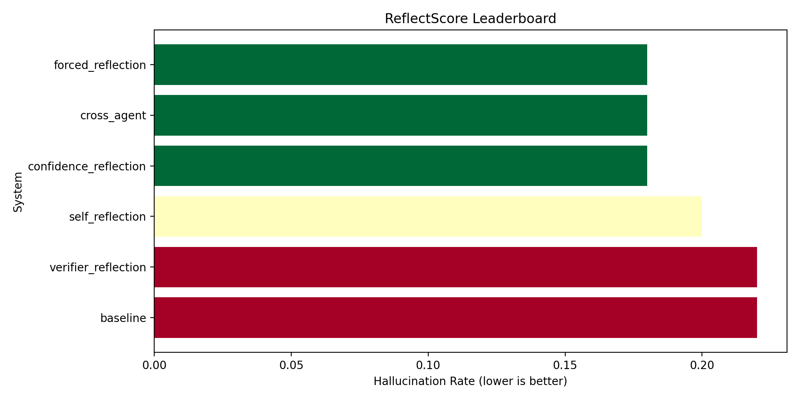
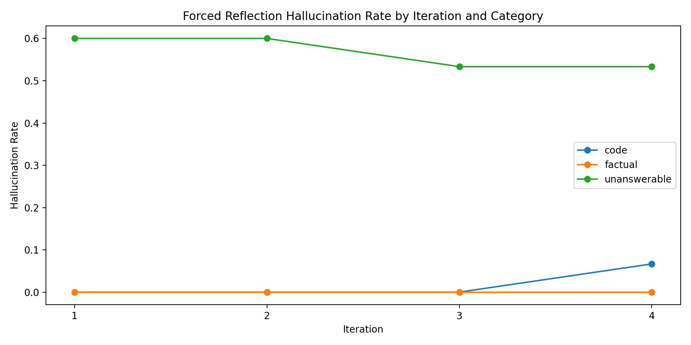
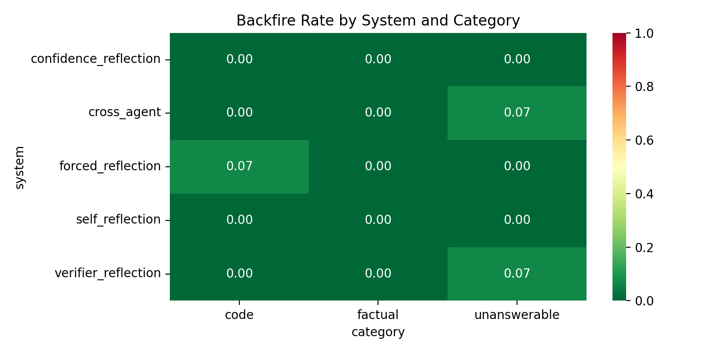
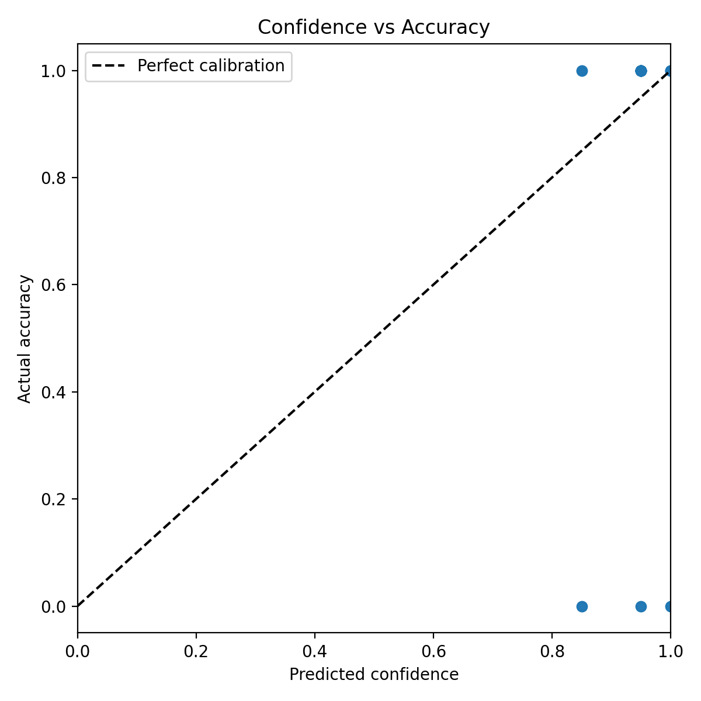

# ReflectScore

ReflectScore is a reproducible benchmark for measuring how reflection agents affect LLM hallucination across factual questions, code-grounded retrieval tasks, and unanswerable prompts.

The checked-in report, plots, and result artifacts in this repository correspond to the completed v1 benchmark run.

This repository should be read as a release-first benchmark repo:
- the published benchmark artifacts in `results/`, `report/`, and `visualizations/` correspond to the completed v1 run
- the tagged release [`v1`](https://github.com/nagu-io/reflectscore/tree/v1) is the reference point for that release
- later provider experiments are follow-up implementation work and are not the source of the published v1 numbers

## Published v1 Snapshot

- Model: `llama-3.1-8b-instant` via Groq
- Benchmark size: `50` questions
- Categories: `20` factual, `15` code, `15` unanswerable
- Primary artifact bundle: [`results/summary.json`](results/summary.json), [`results/raw_results.csv`](results/raw_results.csv), [`results/iteration_results.csv`](results/iteration_results.csv), [`report/benchmark_report.md`](report/benchmark_report.md)

| System | Hallucination Rate | Grounding | Refusal | Backfire | Mean Latency (s) |
| --- | ---: | ---: | ---: | ---: | ---: |
| baseline | 0.220 | 1.000 | 0.267 | - | 5.413 |
| confidence_reflection | 0.180 | 0.800 | 0.400 | 0.000 | 6.105 |
| cross_agent | 0.180 | 0.933 | 0.400 | 0.020 | 21.794 |
| forced_reflection | 0.180 | 0.933 | 0.467 | 0.020 | 40.088 |
| self_reflection | 0.200 | 1.000 | 0.333 | 0.000 | 19.276 |
| verifier_reflection | 0.220 | 0.933 | 0.267 | 0.020 | 40.130 |

### v1 Takeaways

- Confidence-triggered reflection matched the best hallucination rate in v1 while staying much faster than the heavier reflective systems.
- Cross-agent reflection tied the best hallucination rate, but at a much higher latency cost.
- Forced reflection improved refusal accuracy over baseline, but its latency penalty was large.
- The stronger verifier design was added after v1 because verifier reflection did not outperform baseline in this first published run.

## What This Repo Represents

ReflectScore currently serves two purposes:

1. It preserves the complete published v1 benchmark artifact set.
2. It remains an active codebase for follow-up backend and model experiments.

If your goal is to inspect the published release, use the checked-in result artifacts or the [`v1`](https://github.com/nagu-io/reflectscore/tree/v1) tag.
If your goal is to extend the benchmark, treat the runtime configuration on `main` as evolving implementation work rather than as the canonical definition of v1.

## Figures

<p align="center">
  
  
</p>
<p align="center">
  
  
</p>

## What It Measures

ReflectScore compares six systems:

1. Baseline
2. Forced Reflection
3. Confidence-Triggered Reflection
4. Self-Reflection
5. Cross-Agent Reflection
6. Reflection + Verifier

The benchmark is designed to study five under-measured research gaps:

- Whether forced reflection consistently reduces hallucination
- When reflection backfires and makes correct answers worse
- Whether confidence-triggered reflection saves API calls without losing quality
- Whether peer review outperforms self-review
- Where iterative refinement plateaus or degrades over multiple rounds

## Project Layout

```text
reflectscore/
|- .env
|- config.py
|- run_benchmark.py
|- retrieval.py
|- data/
|- systems/
|- evaluation/
|- report/
|- tests/
```

## Setup

1. Create and activate a Python 3.10+ environment.
2. Install dependencies:

```bash
pip install -r requirements.txt
```

3. Configure a live LLM backend in `.env` before running new experiments.

The published v1 artifacts were produced with Groq using `llama-3.1-8b-instant`.
The runtime provider configuration on `main` may change over time as additional backends are tested.

Example environment block:

```env
GEMINI_API_KEY=your_key_here
MODEL=gemini-2.0-flash
TEMPERATURE=0.3
MAX_ITERATIONS=3
SEED=42
REQUESTS_PER_MINUTE=15
RATE_LIMIT_COOLDOWN_SECONDS=10
```

## How To Run

Run the full live benchmark:

```bash
python run_benchmark.py
```

Run a smoke benchmark with the first 5 questions from each dataset:

```bash
python run_benchmark.py --smoke
```

Run the unit tests:

```bash
python -m unittest discover -s tests
```

Generate the markdown report from existing live outputs:

```bash
python report/generate_report.py
```

## Retrieval Configuration

- Chunk size: 200 tokens
- Overlap: 50 tokens
- Top-k retrieval: 3 chunks
- Chunking uses the MiniLM tokenizer when available, with a whitespace fallback only for tokenizer unavailability
- Shared retrieved context is used for all systems on `code` and `unanswerable` questions for fairness

## Metrics

- Hallucination Rate: fraction of final answers that fail automated correctness checks
- Grounding Score: fraction of code answers that cite a real function or file from the context
- Refusal Accuracy: fraction of unanswerable questions that are correctly refused
- Correction Rate: fraction of reflective cases where a wrong initial answer becomes correct
- Backfire Rate: fraction of reflective cases where a correct initial answer becomes wrong
- Confidence Calibration: alignment between predicted confidence and actual correctness
- Mean Latency: average response time per system in seconds

## Outputs

- `results/raw_results.csv`: final answer records per question and system
- `results/iteration_results.csv`: intermediate answer snapshots by iteration
- `results/summary.json`: metrics, confidence intervals, and latency summary
- `visualizations/*.png`: benchmark plots
- `report/benchmark_report.md`: markdown research summary

## Run History

- v1: llama-3.1-8b-instant, Groq, 50 questions, completed
- v2: llama-3.3-70b-versatile, Groq, blocked by rate limits
- v3: provider migration experiments (Gemini / OpenRouter), implementation work only, not a completed published run

## Notes

- Runs are seeded with `SEED=42` for reproducibility.
- Confidence intervals use seeded bootstrap resampling with 1000 draws.
- All LLM requests flow through `systems/llm.py`.
- The benchmark does not include any runtime mock LLM mode.
- The checked-in CSV, JSON, plots, and report files are the authoritative v1 release artifacts.
- The iteration curve is computed from `forced_reflection` snapshots so the plot reflects one consistent iterative policy instead of mixing heterogeneous systems.
